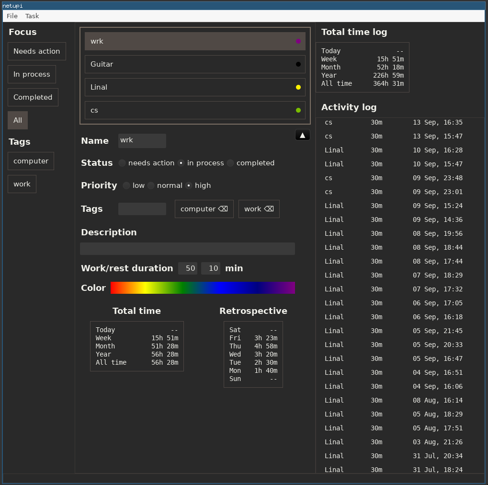

# netupi
minimalistic time tracker with simple pomodoro timer



# Usage
## task list
- up/down arrow : select task
- spacebar : start tracking, pause, switch to other task
- escape : stop tracking
- right mouse button : task context menu
- "n" key : add new task
- "c" key : mark task completed
- TAB key : keyboard focus to task edit widget

# Program data
Program settings and tasks are stored user's config directory. The default values are:
## Linux:
`$XDG_CONFIG_HOME/netupi or $HOME/.config`
i.e. `/home/alice/.config`

## macOS
`$HOME/Library/Application Support/netupi`
i.e. `/Users/Alice/Library/Application Support/netupi`

## Windows
`{FOLDERID_RoamingAppData}\netupi`
i.e. `C:\Users\Alice\AppData\Roaming\netupi`

# Configuration
    No configuration at the moment.

# Command line arguments
- `--config-dir <DIR>` path for user's config directory

# Importing CSV from [Goodtime](https://f-droid.org/en/packages/com.apps.adrcotfas.goodtime/)
```
cargo run --bin import_csv <filename>
```

# Building
1. install [rust](https://www.rust-lang.org/tools/install)
2. ubuntu packages: libsqlite3-0 libasound2-dev libglib2.0-dev libpango1.0-dev libgdk-pixbuf2.0-dev libgtk-3-dev
3. cargo build --release

# Installing
- TBD
